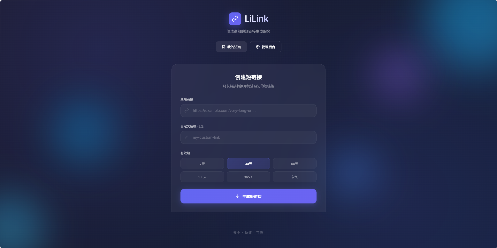
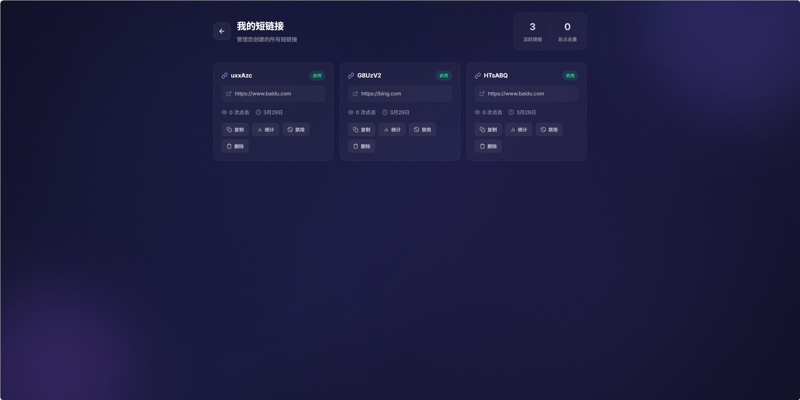
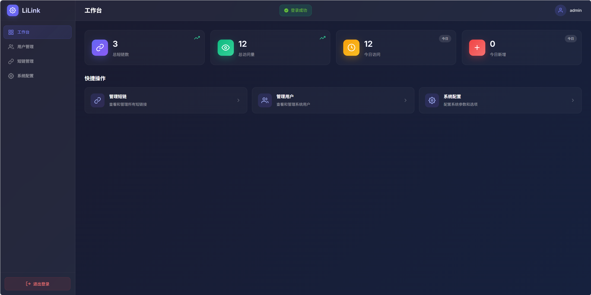
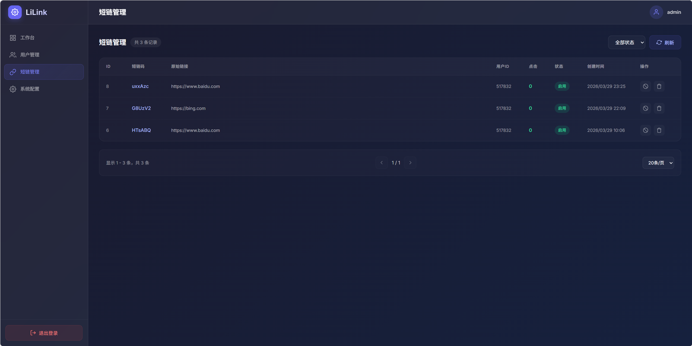
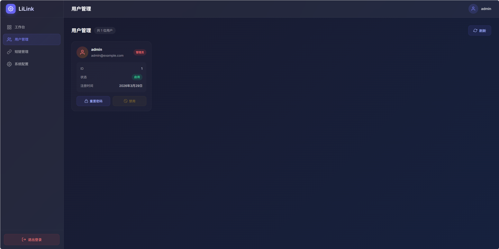
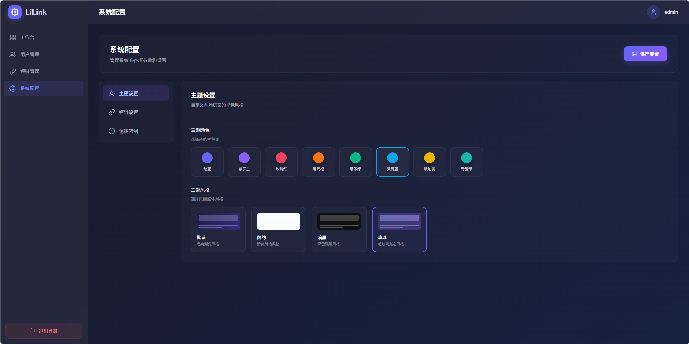

# 🔗 Li-Link 短链系统

一个功能完整、界面美观的短链系统，包含用户端（C端）和管理后台。

## ✨ 功能特性

### 🌐 C端（用户端）
- **短链生成**：无需登录即可生成短链接
- **自定义后缀**：支持自定义短链后缀（可配置开关）
- **过期时间**：支持设置短链过期时间（默认30天，最长10年）
- **QR码生成**：自动生成短链接二维码，支持下载
- **访问统计**：记录访问IP、设备、浏览器、操作系统等信息
- **短链管理**：查看、启用/禁用、删除自己的短链
- **统计图表**：PV/UV趋势、设备分布、浏览器分布等

### 🎛️ 管理后台
- **安全登录**：四位数图片验证码防爆破
- **仪表盘**：总短链数、总访问量、今日访问量等统计数据
- **用户管理**：查看所有用户、禁用/启用用户、重置密码
- **短链管理**：查看所有短链、按条件筛选、启用/禁用/删除
- **系统配置**：
  - 短链长度配置
  - 是否允许自定义后缀
  - 默认过期天数
  - 用户创建限制（按天/月/年）
- **主题配置**：8种主题颜色 + 4种风格预设

## 🛠️ 技术栈

### 后端
| 技术 | 说明 |
|------|------|
| Spring Boot 3.2.x | 基础框架 |
| Spring Security | 安全认证 |
| MyBatis Plus | ORM框架 |
| Redis | 缓存、分布式锁 |
| MySQL 8.0+ | 数据库 |
| JWT | Token认证 |

### 前端
| 技术 | 说明 |
|------|------|
| Vue 3 | 前端框架 |
| Vite | 构建工具 |
| Element Plus | UI组件库 |
| Pinia | 状态管理 |
| Vue Router | 路由管理 |
| ECharts | 图表库 |
| Axios | HTTP客户端 |

## 📁 项目结构

```
li-link/
├── backend/                    # 后端项目
│   ├── src/main/java/
│   │   └── com/example/shortlink/
│   │       ├── controller/     # 控制器层
│   │       ├── service/        # 服务层
│   │       ├── mapper/         # 数据访问层
│   │       ├── entity/         # 实体类
│   │       ├── dto/            # 数据传输对象
│   │       ├── config/         # 配置类
│   │       ├── component/      # 组件
│   │       └── common/         # 公共类
│   └── src/main/resources/
│       └── application.yml     # 配置文件
├── frontend/                   # 前端项目
│   ├── src/
│   │   ├── views/              # 页面组件
│   │   ├── components/         # 公共组件
│   │   ├── api/                # API接口
│   │   ├── utils/              # 工具函数
│   │   └── assets/             # 静态资源
│   └── package.json
└── database/                   # 数据库脚本
    └── init.sql
```

## 🚀 快速开始

### 1. 环境要求
- JDK 17+
- Node.js 16+
- MySQL 8.0+
- Redis

### 2. 克隆项目
```bash
git clone https://github.com/your-username/li-link.git
cd li-link
```

### 3. 初始化数据库
```bash
mysql -u root -p < database/init.sql
```

### 4. 配置后端
修改 `backend/src/main/resources/application.yml`：
```yaml
spring:
  datasource:
    url: jdbc:mysql://localhost:3306/short_link
    username: root
    password: your_password
  data:
    redis:
      host: localhost
      port: 6379
```

### 5. 启动后端
```bash
cd backend
mvn spring-boot:run
```

### 6. 启动前端
```bash
cd frontend
npm install
npm run dev
```

### 7. 访问系统
- 🏠 前端首页：http://localhost:5173
- 🔧 后端API：http://localhost:8080
- 📖 API文档：http://localhost:8080/swagger-ui.html
- 👤 默认管理员：`admin` / `admin123`

## 📸 系统截图

| 首页 | 用户短链管理 |
|------|-------------|
|  |  |

| 管理后台 - 仪表盘 | 管理后台 - 短链管理 |
|------------------|-------------------|
|  |  |

| 管理后台 - 用户管理 | 管理后台 - 系统配置 |
|--------------------|--------------------|
|  |  |

## 🎨 主题配置

系统支持丰富的主题配置：

### 主题颜色
- 💜 默认紫
- 🔵 商务蓝
- 💚 自然绿
- 🧡 活力橙
- 🔴 热情红
- 🩷 甜美粉
- 🩵 清新青
- ⚫ 经典黑

### 主题风格
- 🌟 默认风格：渐变背景 + 玻璃态效果
- 📄 简约风格：淡蓝色调 + 简洁设计
- 🌙 暗黑风格：深色背景 + 护眼配色
- 💎 玻璃风格：毛玻璃效果 + 透明质感

## 📊 API接口

### 公开接口
| 方法 | 路径 | 说明 |
|------|------|------|
| POST | /api/shortlink/create | 创建短链 |
| GET | /{shortCode} | 短链跳转 |
| GET | /api/config/theme | 获取主题配置 |

### 管理接口
| 方法 | 路径 | 说明 |
|------|------|------|
| POST | /api/admin/login | 管理员登录 |
| GET | /api/admin/captcha | 获取验证码 |
| GET | /api/admin/users | 获取用户列表 |
| GET | /api/admin/links | 获取短链列表 |
| PUT | /api/admin/config | 更新系统配置 |

## 🔒 安全特性

- ✅ 四位数图片验证码防爆破
- ✅ JWT Token认证
- ✅ 密码MD5加密存储
- ✅ 接口权限控制
- ✅ CORS跨域配置

## 📝 更新日志

### v1.0.0
- ✨ 初始版本发布
- ✨ 短链生成与管理
- ✨ 访问统计与图表
- ✨ 管理后台
- ✨ 主题配置系统
- ✨ QR码生成

## 📄 许可证

[MIT License](LICENSE)

## 🤝 贡献

欢迎提交 Issue 和 Pull Request！

---

⭐ 如果这个项目对你有帮助，请给一个 Star 支持一下！
